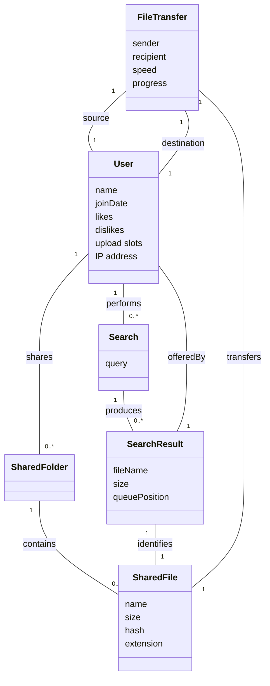

```mermaid 
classDiagram
    class User {
        name
        joinDate
        likes
        dislikes
        upload slots
        IP address
    }
    class SharedFile {
        name
        size
        hash
        extension
        
    }
    class FileTransfer {
        sender
        recipient
        speed
        progress
    }
    class Search {
        query
    }
    class SearchResult {
        fileName
        size
        queuePosition
    }
    User "1" -- "0..*" SharedFolder : shares
    SharedFolder "1" -- "0..*" SharedFile : contains

    User "1" -- "0..*" Search : performs
    Search "1" -- "0..*" SearchResult : produces

    SearchResult "1" -- "1" SharedFile : identifies
    SearchResult "1" -- "1" User : offeredBy

    FileTransfer "1" -- "1" SharedFile : transfers
    FileTransfer "1" -- "1" User : source
    FileTransfer "1" -- "1" User : destination
```
